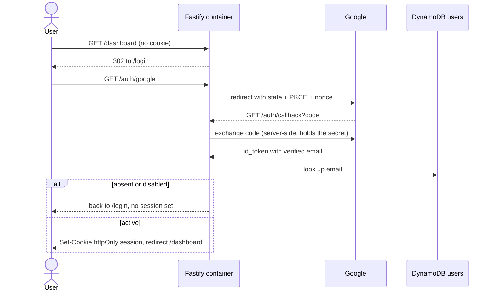

# brianjordans-console

Management console for Brian Jordan's personal technical operations, hosted at
**https://app.brianjordans.com**.

The public marketing site lives in a separate repository,
[brianjordans-website](https://github.com/actix-bjordan/brianjordans-website).

## What this is

One Docker image containing the React app and the Fastify server that serves
it. The server performs the Google OAuth code exchange, issues an `httpOnly`
session cookie, and gates every route. An unauthenticated visitor can reach
`/login`, `/auth/*`, and `/healthz`; everything else, **including the JavaScript
bundle itself**, requires a session. Authentication is structural rather than a
client-side guard.

Google is the only credential authority. This app stores *who is allowed in*
(name, email, role) and never stores or verifies a password.

The panels themselves are still empty states; no data sources are connected
yet. Auth, RBAC, and hosting are real.

## Architecture

| Directory | Contents |
|---|---|
| `app/` | React 19 + TypeScript + Vite single-page app (React Router). Client only. |
| `server/` | Fastify 5 + TypeScript. Auth, users API, and gated static serving of `app/dist`. |
| `infra/` | AWS CDK (TypeScript), two stacks in `us-east-1`. |
| `scripts/` | `deploy.sh`: build, push to ECR, roll the ECS service. |
| `Dockerfile` | Multi-stage, non-root, `linux/amd64`. |
| `docker-compose.yml` | Runs the whole console locally against a local DynamoDB. |

### Stacks

- **BrianJordansConsoleFoundation** — ECR repository (scan on push, keeps the
  last 10 images) and the DynamoDB users table. Separate because the Fargate
  task cannot start until an image exists, and an image cannot be pushed until
  the repository does.
- **BrianJordansConsole** — ACM certificate, VPC, ECS cluster, Fargate service,
  Application Load Balancer, and the Route 53 alias records.

The VPC has **public subnets only and no NAT gateway**; a NAT would cost more
than the rest of the stack combined. The task gets a public IP so it can pull
its image and reach Google's token endpoint, and its security group accepts
traffic only from the load balancer.

The Route 53 hosted zone for `brianjordans.com` is created and owned by the
website repository. This stack only references it by ID to attach the
`app.brianjordans.com` alias records, and never modifies the zone itself.

### Why this is a separate origin

The console is deliberately *not* served from a path under `brianjordans.com`.
Its own origin means the browser, not our configuration, enforces isolation of
console session state from the public site: separate cookies, separate
`localStorage`, separate JS context. It also lets the two carry different cache
and indexing policies without maintaining path-prefix behaviors, and decouples
deploy blast radius.

## Authentication and authorization



The session cookie is an encrypted JWT (`A256GCM`, `httpOnly`, `Secure`,
`SameSite=Lax`) carrying only the email and Google subject. Every request
revalidates that email against DynamoDB through a 30-second cache, so disabling
someone takes effect in about half a minute rather than waiting for the cookie
to expire.

### Roles

| Role | Access |
|---|---|
| `admin` | Everything, including the Users page and `/api/users` |
| `member` | Console pages; no user management |

Users are keyed on lowercased email and hold `firstName`, `lastName`, `role`,
`status`, `googleSub` (bound on first sign-in), `createdAt`, `updatedAt`, and
`lastLoginAt`.

The API refuses to demote or disable the last active admin, and refuses to let
an admin remove their own access, so the console cannot be locked out from
inside. On startup, if the directory has no active admin,
`BOOTSTRAP_ADMIN_EMAIL` is seeded as one.

## One-time setup

### 1. Create the Google OAuth client

In the [Google Cloud console](https://console.cloud.google.com/apis/credentials):

1. Pick or create a project, then open **APIs & Services → OAuth consent
   screen**. If `brianjordans.com` is a Google Workspace domain, set the user
   type to **Internal**. That blocks every account outside the organization
   before the app's own check even runs.
2. Go to **Credentials → Create credentials → OAuth client ID**, type **Web
   application**, name it `brianjordans-console`.
3. Under **Authorized redirect URIs** add:
   - `https://app.brianjordans.com/auth/callback`
   - `http://localhost:8080/auth/callback` (only if you want local sign-in)
4. Copy the **Client ID** and **Client secret**.

No API enablement is needed; `openid email profile` is available by default.

### 2. Store the secrets in SSM

Run these yourself so no secret passes through a terminal transcript or a
CloudFormation template. The `--value` prompts avoid putting values in shell
history:

```bash
read -rs -p "Google client ID: " GID && aws ssm put-parameter \
  --name /brianjordans/console/google-client-id \
  --type SecureString --overwrite --value "$GID" --region us-east-1 && unset GID

read -rs -p "Google client secret: " GSEC && aws ssm put-parameter \
  --name /brianjordans/console/google-client-secret \
  --type SecureString --overwrite --value "$GSEC" --region us-east-1 && unset GSEC

aws ssm put-parameter \
  --name /brianjordans/console/session-secret \
  --type SecureString --overwrite --region us-east-1 \
  --value "$(node -e "console.log(require('crypto').randomBytes(48).toString('base64url'))")"
```

Rotating `session-secret` invalidates every existing session, which is the
fastest way to sign everyone out.

The task definition injects all three at container start via the ECS `secrets`
field. SSM standard parameters are free, unlike Secrets Manager.

### 3. Deploy

Order matters on the first run, because the service will not start without an
image:

```bash
npm run install:all
npm run deploy:foundation   # ECR + DynamoDB
npm run deploy              # build, push image to ECR
npm run deploy:infra        # VPC, ALB, ECS service
```

## Deploying afterwards

Application changes:

```bash
npm run deploy
```

This builds the image for `linux/amd64`, pushes it to ECR tagged with the git
SHA and `latest`, forces a new ECS deployment, waits for the service to reach a
steady state, and then verifies two things through the load balancer: `/healthz`
returns 200, and an unauthenticated `/dashboard` returns a 302 to `/login`
rather than the bundle. It exits non-zero if either check fails.

Infrastructure changes:

```bash
npm run diff
npm run deploy:infra
```

## Local development

`docker compose` runs the whole console, including a local DynamoDB, so nothing
touches AWS:

```bash
cp .env.example .env    # fill in the Google client ID and secret
npm run up              # http://localhost:8080
```

Sign-in works locally only if `http://localhost:8080/auth/callback` is an
authorized redirect URI on the Google client.

For a faster front-end loop, run the Vite dev server against the container:

```bash
cd app && npm run dev   # http://localhost:5174
```

## Verification

| Check | Expected |
|---|---|
| `docker compose up` with no AWS credentials | Whole console runs; the image is self-contained |
| Sign in with a Google account not in the users table | Back to `/login?reason=denied`, no cookie set |
| `GET /dashboard` or `/assets/*` with no cookie | 302 to `/login`, never the bundle |
| Disable a user in the UI | They are locked out within ~30 seconds |
| A member calls `/api/users` | 403 |

## Resources

| Resource | Value |
|---|---|
| Console URL | https://app.brianjordans.com |
| ECR repository | `brianjordans-console` |
| ECS cluster / service | see the `ClusterName` / `ServiceName` stack outputs |
| Route 53 hosted zone (owned by website repo) | `Z00406963PWDGGJZA3WA2` |

## Running cost

Roughly $26/month:

| Item | Monthly |
|---|---|
| Application Load Balancer | $16.43 base plus about $2 in capacity units |
| Fargate, 0.25 vCPU / 0.5 GB, one task | $8.98 |
| ECR, DynamoDB on-demand, SSM standard, CloudWatch Logs | under $1 combined |

The load balancer is the bulk of it and is the price of a real, always-on
authenticated origin. AWS WAF in front would add about $8/month; it is not
enabled, but it is the recommended next hardening step for an internet-facing
load balancer.
